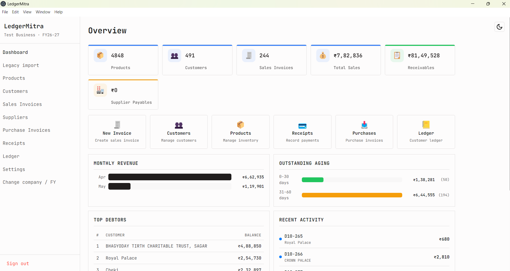
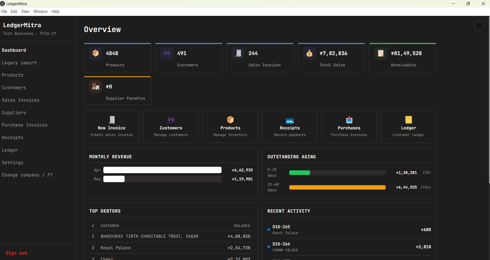
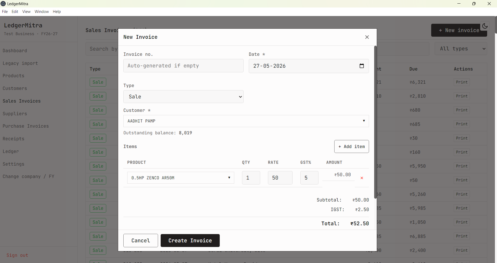
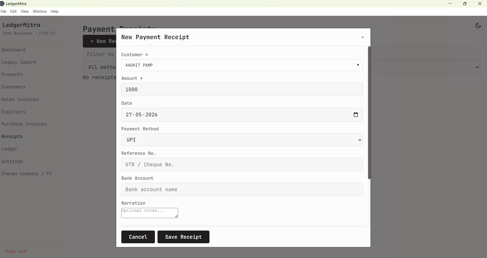
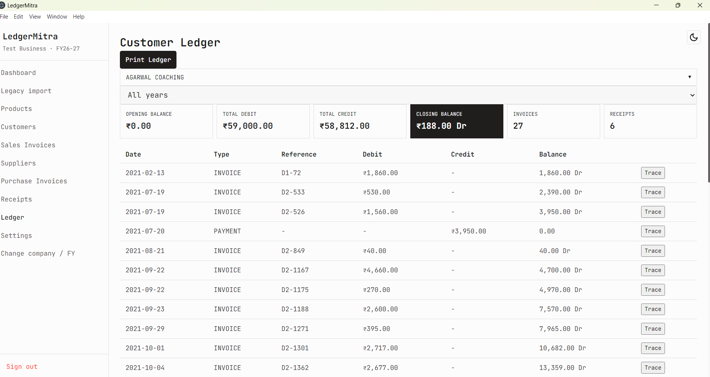
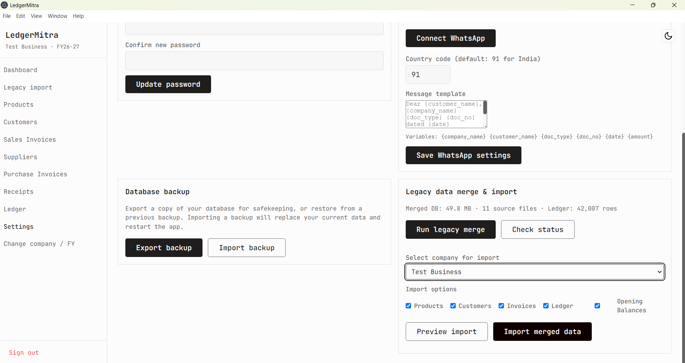
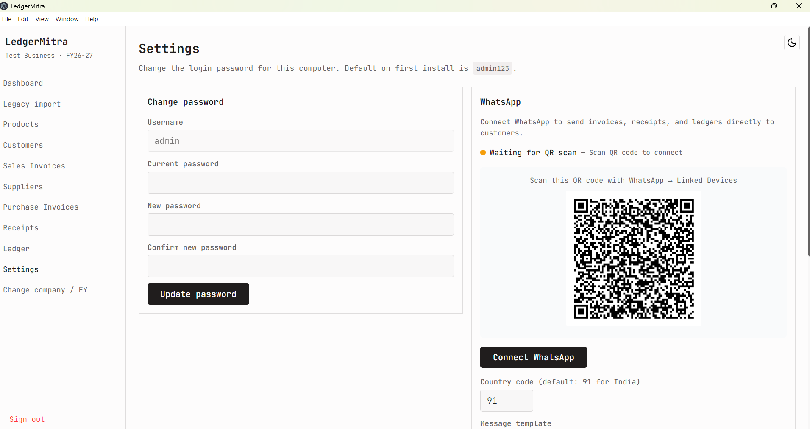

<div align="center">
  <h1>LedgerMitra</h1>
  <p>
    <strong>Modern desktop accounting software for small businesses</strong>
  </p>
  <p>
    
    
    
    
  </p>
  <p>
    <a href="#features">Features</a> •
    <a href="#tech-stack">Tech Stack</a> •
    <a href="#getting-started">Getting Started</a> •
    <a href="#usage">Usage</a> •
    <a href="#migration">Speed Plus Migration</a>
  </p>
  <br/>
</div>

LedgerMitra is a greenfield desktop accounting application built with Electron, React, and TypeScript. It replaces legacy accounting software (Speed Plus) while providing a modern, intuitive interface for day-to-day bookkeeping — invoices, receipts, purchases, ledger management, and GST-ready reporting.

All data stays **offline on your machine** — no cloud, no subscriptions, no internet required.

---

## Why LedgerMitra?

- **Offline-first.** All data lives in a local SQLite database. No server, no cloud dependency, no monthly fees.
- **Privacy-focused.** Your financial data never leaves your machine. Backup is a file copy.
- **GST-ready.** Built-in CGST, SGST, IGST support with auto-calculation on invoices.
- **Legacy migration.** Full import pipeline from Speed Plus (`.mdb`/`.bmw`) — no manual data entry for existing users.
- **Lightweight.** Single Windows desktop app. No browser, no server process, no Docker.

## Features

- **Dashboard** — KPI cards, sales/purchase summaries, outstanding snapshots
- **Invoicing** — Create and manage sales invoices with line items, GST, and auto-numbering
- **Purchase Invoices** — Record purchases with stock and ledger integration
- **Payment Receipts** — Receive payments with auto or manual invoice allocation
- **Ledger** — Customer-wise, year-wise, and invoice-wise ledger with debit/credit summaries
- **Customers & Suppliers** — Party master management with opening balances
- **Products** — SKU-based product catalog with rates, GST, and stock tracking
- **Financial Years** — Multi-FY support with balance carry-forward across years
- **Print & PDF** — Invoice, receipt, and ledger printing with save-to-PDF
- **WhatsApp Integration** — Send invoices and receipts directly via WhatsApp Web
- **Backup & Restore** — One-click database export and import
- **Legacy Import** — Full migration engine from Speed Plus MDB/BMW files
- **Multi-Company** — Support for multiple companies with separate books

## Key Accounting Features

| Feature | Details |
|---------|---------|
| **Double-entry ledger** | Every invoice, receipt, and payment creates debit/credit entries. Balances are always consistent. |
| **GST support** | CGST + SGST (intra-state) and IGST (inter-state) with configurable rates per product. Auto-calculated on invoices. |
| **Invoice aging** | Outstanding amounts tracked per invoice. Aging buckets for follow-up. |
| **Balance carry-forward** | Customer opening balances flow across financial years via `fy_carry_forwards` table with full audit trail. |
| **Auto-numbering** | Invoice and receipt numbers auto-generated per financial year. |
| **Stock tracking** | Product stock quantity updated on invoice/purchase creation. Reorder level alerts on dashboard. |
| **Payment allocation** | Receipts can be auto-allocated against oldest outstanding invoices or manually assigned. |

## Tech Stack

| Layer | Technology |
|-------|-----------|
| Desktop Shell | [Electron 30](https://www.electronjs.org/) |
| Frontend | [React 18](https://react.dev/) + [TypeScript](https://www.typescriptlang.org/) |
| Build | [electron-vite](https://electron-vite.org/) + [Vite 6](https://vitejs.dev/) |
| Database | [better-sqlite3](https://github.com/WiseLibs/better-sqlite3) (SQLite, WAL mode) |
| Auth | [bcryptjs](https://github.com/dcodeIO/bcrypt.js) (local password hashing) |
| Import Engine | [mdb-reader](https://github.com/DeltaRaz/mdb-reader) (Access .mdb/.bmw) |
| Printing | HTML → PDF via Electron's built-in print API |
| WhatsApp | [whatsapp-web.js](https://github.com/pedroslopez/whatsapp-web.js) |
| Packaging | [electron-builder](https://www.electron.build/) (NSIS for Windows) |

## Screenshots

### Dashboard

Light & dark theme variants:

<p align="center">
  
  <br/>
  <em>Dashboard — KPI cards, revenue chart, top debtors, invoice aging, recent activity</em>
</p>

<p align="center">
  
  <br/>
  <em>Dashboard (dark theme)</em>
</p>

### Invoice Form

<p align="center">
  
  <br/>
  <em>Sales invoice with line-item entry, customer search, GST auto-calculation</em>
</p>

### Receipt Entry

<p align="center">
  
  <br/>
  <em>Payment receipt with auto-allocation to outstanding invoices</em>
</p>

### Ledger View

<p align="center">
  
  <br/>
  <em>Customer-wise ledger with debit/credit columns, running balance, date filters</em>
</p>

### Legacy Import

<p align="center">
  
  <br/>
  <em>Speed Plus MDB file analyzer — table schemas, row counts, date ranges</em>
</p>

### WhatsApp Integration

<p align="center">
  
  <br/>
  <em>Send invoice/receipt PDFs directly via WhatsApp Web with customizable message</em>
</p>

## Licensing

LedgerMitra uses a **free + premium** model:

### Free (Core)
- Invoicing, Ledger, Products, Customers, Receipts
- Purchase Invoices, Dashboard, Financial Years
- 30-day trial with all features unlocked

### Premium
- WhatsApp Integration
- Legacy Speed Plus Import
- Multi-Company
- Backup & Restore
- Print & PDF

| License Type | Price | Includes |
|-------------|-------|----------|
| Free | ?0 | Core features |
| Premium Perpetual | ?4,999 one-time | All features + 1 year updates |
| Premium Yearly | ?1,999/year | All features + all updates + priority support |

### For Customers

1. Download and install LedgerMitra
2. All features work during the 30-day trial
3. After trial, premium features require a license key
4. Activate in: **Settings > License > Activate**

### For Developers (License Generator)

```bash
# Generate a license key for a customer
npx tsx scripts/license-gen.ts
```

The license key is signed with RSA-2048 and validated offline. Private key stays with the developer.

## Getting Started

### Prerequisites

- Windows 10 or later
- [Node.js](https://nodejs.org/) v18 or later
- [npm](https://www.npmjs.com/) v9 or later
- [Git](https://git-scm.com/)

> **New to development?** Run `setup.bat` — it checks for all dependencies and installs any that are missing.

### Installation

**Automatic (recommended for new users):**

```bat
git clone https://github.com/akashnikhra/LedgerMitra.git
cd LedgerMitra
setup.bat
```

`setup.bat` checks for Node.js, npm, and Git. If anything is missing, it downloads and installs it with your permission, then runs `install.bat` to install project dependencies.

**Manual:**

```bat
git clone https://github.com/akashnikhra/LedgerMitra.git
cd LedgerMitra
install.bat
```

### Development

```bat
npm run dev
```

### Build for production

```bat
npm run build
npm run package:win
```

The packaged installer will be in the `release/` directory.

## Usage

### First Run

1. Launch the app (default login: `admin` / `admin123`)
2. Create a company profile
3. Set up a financial year (April–March by default)
4. Start creating customers, products, and invoices

> Your database is created at `data/ledgermitra.db` (or wherever `LEDGERMITRA_DATA_DIR` points). It's a single file — backup by copying it.

### Legacy Import

If you have existing data from Speed Plus accounting software:

1. Place your `spd.mdb` or `spd.bmw` files in `Upload/Data/`
2. Open **Legacy Import** from the sidebar
3. Select the file and map it to your company
4. Data is imported with audit trail and deduplication

> See [docs/LEGACY_DATA_MAP.md](docs/LEGACY_DATA_MAP.md) for the field-level mapping reference.

## Migration

### Speed Plus → LedgerMitra

LedgerMitra provides a complete migration pipeline from Speed Plus (`.mdb` / `.bmw`) files:

| Legacy Table | New Table | Description |
|-------------|-----------|-------------|
| `Items` | `products` | SKU, rates, GST, stock |
| `Account` | `customers` | Party ledgers, opening balance |
| `BillMaster` | `invoices` | Sales vouchers |
| `Ledger` | `ledger_entries` | Payments / receipts |
| `Company` | `company` | Company name during wizard |

The import engine handles:
- Multi-FY detection within a single MDB file
- Deduplication via file hash tracking
- Balance carry-forward across financial years
- Audit logging with skipped item details

Set the legacy data path via environment variable:

```bat
set LEDGERMITRA_LEGACY_DATA=F:\path\to\Upload\Data
```

## Project Structure

```
LedgerMitra/
├── database/
│   └── schema.sql              # SQLite schema (17 tables)
├── docs/
│   └── LEGACY_DATA_MAP.md      # Field-level mapping reference
├── scripts/
│   ├── merge-legacy-data.mjs   # Merge multiple MDBs into one DB
│   └── patch-mdb-reader.mjs    # Post-install native module patch
├── src/
│   ├── main/                   # Electron main process
│   │   ├── main.ts             # App entry, window creation
│   │   ├── preload.ts          # Context bridge
│   │   ├── database.ts         # SQLite init, migrations, helpers
│   │   ├── ipc-handlers.ts     # All IPC channel handlers
│   │   ├── mdb-import.ts       # Legacy MDB import engine
│   │   ├── invoice.ts          # Sales invoice CRUD
│   │   ├── purchase-invoice.ts # Purchase invoice CRUD
│   │   ├── ledger.ts           # Ledger entry queries
│   │   ├── receipt.ts          # Receipt + allocation management
│   │   ├── customer.ts         # Customer CRUD
│   │   ├── supplier.ts         # Supplier CRUD
│   │   ├── product.ts          # Product CRUD
│   │   ├── auth.ts             # Login/logout/password
│   │   ├── session.ts          # Company/FY session
│   │   ├── company.ts          # Company CRUD
│   │   ├── financial-year.ts   # Financial year CRUD
│   │   ├── print.ts            # HTML-to-PDF printing
│   │   └── whatsapp.ts         # WhatsApp integration
│   ├── renderer/               # React UI
│   │   ├── index.html          # HTML shell
│   │   ├── main.tsx            # React entry point
│   │   ├── App.tsx             # Root with screen router
│   │   ├── context/
│   │   ├── styles/
│   │   └── components/         # 25+ React components
│   └── shared/
│       ├── types.ts            # TypeScript interfaces
│       └── constants.ts        # App config & IPC channels
├── Upload/                     # Legacy data source directory
├── .gitignore
├── electron.vite.config.ts
├── package.json
├── install.bat
└── start.bat
```

## Configuration

### Environment Variables

| Variable | Description | Default |
|----------|-------------|---------|
| `LEDGERMITRA_DATA_DIR` | Database file location | `<project>/data/` |
| `LEDGERMITRA_LEGACY_DATA` | Path to Speed Plus uploads | `F:\accounting_software\Upload\Data\` |

### Default Credentials

- **Username:** `admin`
- **Password:** `admin123`

## Contributing

Contributions are welcome. Please open an issue first to discuss the change, then submit a pull request.

1. Fork the repository
2. Create a feature branch (`git checkout -b feature/amazing-feature`)
3. Commit your changes (`git commit -m 'Add amazing feature'`)
4. Push to the branch (`git push origin feature/amazing-feature`)
5. Open a Pull Request

## License

Distributed under the MIT License. See `LICENSE` for more information.
